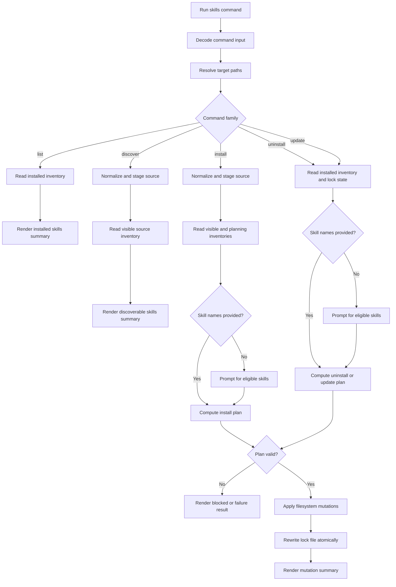
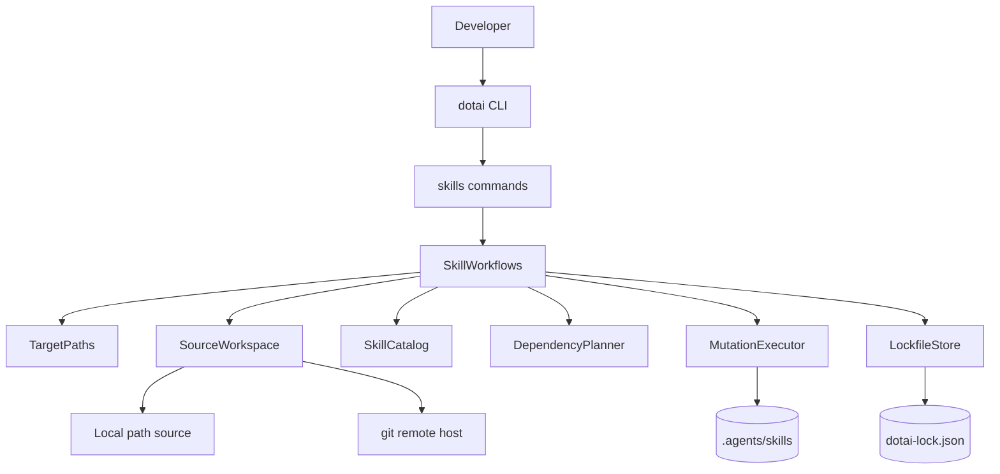
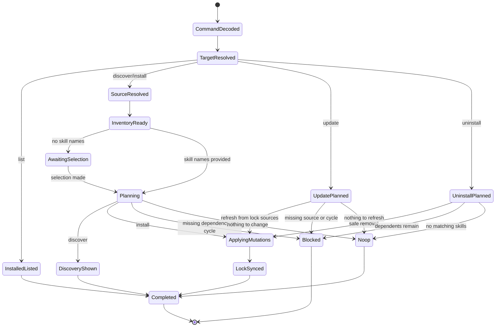
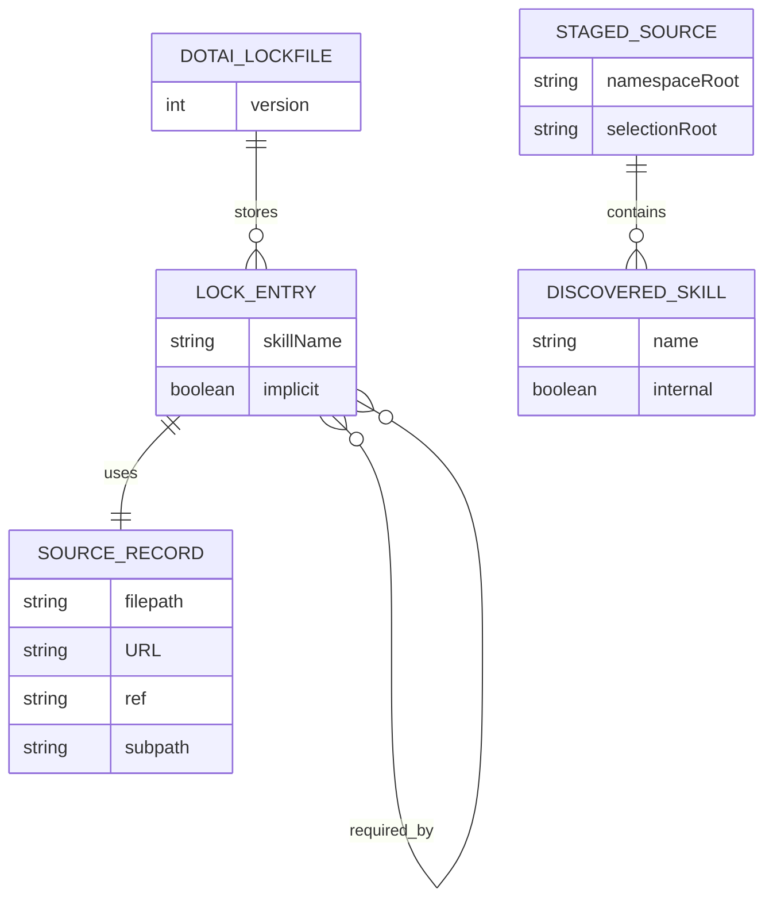

## Architecture Summary

- Runtime profile: CLI-only Bun application authored in TypeScript and structured as an Effect application.
- Composition root: `src/cli/main.ts` as the package bin entry, assembling one `MainLayer` plus the nested `dotai skills` command tree and running it through the Effect Bun runtime via `BunRuntime.runMain` from `@effect/platform-bun`.
- Main execution model: One-shot command execution that decodes command input, resolves the target and any explicit source, computes a complete plan, applies filesystem mutations only after validation succeeds, rewrites the lock file atomically, and renders a human-readable summary or failure.
- Summary: `dotai` is designed as thin CLI runtime edges over a small set of gray-box capability services: target-path resolution, source normalization and staging, skill catalog discovery, dependency planning, mutation execution, and lock-file persistence. All remote sources normalize to git-backed locators with optional `ref` and `subpath`, operator-facing discovery hides `metadata.internal: true` skills, dependency resolution expands same-source names plus URL locators before mutation, and command workflows preserve target plus lock-file consistency through same-device staging, atomic replace, and best-effort rollback.

## System Context

- Primary actors: project developer, home-directory maintainer, skill publisher or curator.
- User surface: `dotai skills list`, `discover`, `install` or `add`, `uninstall` or `remove`, and `update`.
- Runtime environment: Local terminal process on Bun with access to the current working directory, the user home directory, the local filesystem, and a system `git` executable.
- External boundaries: local path sources, remote git hosts such as GitHub and GitLab, `SKILL.md` frontmatter files, target `.agents/skills` directories, and lock files at `dotai-lock.json` or `~/.agents/.dotai-lock.json`.
- Story or requirements traceability: FR1.1-FR1.19, NFR2.1-NFR2.5, TC3.1-TC3.10, DR4.1-DR4.15, IR5.1-IR5.5, DEP6.1-DEP6.5.

### Process Flowchart



The process flowchart shows the command-level gating that keeps planning ahead of mutation. The context flowchart below shifts from step order to the stable runtime boundaries involved in that flow.

### Context Flowchart



The flowchart emphasizes the single runtime seam: the CLI command tree delegates into workflow orchestration, which then crosses into source acquisition, planning, mutation, and persistence boundaries.

## Components and Responsibilities

### Behavior State Diagram



The command lifecycle is intentionally plan-first. All dependency expansion, source staging, and blocker detection happen before any target mutation begins.

### CLI Runtime Edge

The CLI Runtime Edge turns parsed terminal commands into explicit workflow calls and turns workflow results back into consistent user-facing output.

- Boundary type: runtime edge module built with `effect/unstable/cli`.
- Owned capability: Decode the nested `dotai skills` command surface, resolve flags and positional arguments, trigger interactive fallback selection when names are omitted, and render operator-facing summaries plus failures.
- Hidden depth: Command-specific prompt wiring, argument decoding, exit-code mapping, and display formatting remain inside the edge instead of leaking into deeper services.
- Inputs: `process.argv`, environment, standard input and output, current working directory, and approved command grammar from TC3.7.
- Outputs: Calls into `SkillWorkflows`, then renders one consistent operator-facing result layout per command: summary, summary-with-warnings, blocked, failure, or no-op, plus process exit success or failure.
- Story impact: Supports all stories, especially target selection, discovery, install selection, uninstall safety, and update reporting.

### SkillWorkflows

`SkillWorkflows` is the orchestration layer that executes the five user-visible skill lifecycle workflows by coordinating the lower-level services.

- Boundary type: feature orchestration service.
- Owned capability: Implement the user-visible workflows for `list`, `discover`, `install`, `uninstall`, and `update` by coordinating target resolution, source staging, catalog reads, planning, mutation, and lock reconciliation.
- Caller-visible contract: `SkillWorkflows` shall expose five separate methods rather than one generic dispatcher: `list(input: ListWorkflowInput)`, `discover(input: DiscoverWorkflowInput)`, `install(input: InstallWorkflowInput)`, `uninstall(input: UninstallWorkflowInput)`, and `update(input: UpdateWorkflowInput)`.
- Hidden depth: Workflow branching for local versus global targets, interactive versus positional selection, full versus selective update, and no-op reporting stays behind these workflow-specific method boundaries.
- Inputs: Decoded command input plus `TargetPaths`, `SourceWorkspace`, `SkillCatalog`, `DependencyPlanner`, `MutationExecutor`, and `LockfileStore`.
- Outputs: Workflow-specific result types grouped under the `WorkflowResult` family so the CLI edge can render summaries, warnings, blockers, or failures without re-deriving workflow semantics.

Representative Effect contract:

```ts
import { Context, Effect, Schema } from "effect";

export const ListWorkflowInput = Schema.Struct({
  global: Schema.Boolean,
});
export type ListWorkflowInput = Schema.Schema.Type<typeof ListWorkflowInput>;

export const DiscoverWorkflowInput = Schema.Struct({
  global: Schema.Boolean,
  source: Schema.String,
});
export type DiscoverWorkflowInput = Schema.Schema.Type<typeof DiscoverWorkflowInput>;

export const InstallWorkflowInput = Schema.Struct({
  global: Schema.Boolean,
  source: Schema.String,
  requestedSkillNames: Schema.Array(Schema.String),
});
export type InstallWorkflowInput = Schema.Schema.Type<typeof InstallWorkflowInput>;

export const UninstallWorkflowInput = Schema.Struct({
  global: Schema.Boolean,
  requestedSkillNames: Schema.Array(Schema.String),
});
export type UninstallWorkflowInput = Schema.Schema.Type<typeof UninstallWorkflowInput>;

export const UpdateWorkflowInput = Schema.Struct({
  global: Schema.Boolean,
  requestedSkillNames: Schema.Array(Schema.String),
});
export type UpdateWorkflowInput = Schema.Schema.Type<typeof UpdateWorkflowInput>;

export class SkillWorkflows extends Context.Service<
  SkillWorkflows,
  {
    readonly list: (input: ListWorkflowInput) => Effect.Effect<ListWorkflowResult, WorkflowError>;
    readonly discover: (
      input: DiscoverWorkflowInput,
    ) => Effect.Effect<DiscoverWorkflowResult, WorkflowError>;
    readonly install: (
      input: InstallWorkflowInput,
    ) => Effect.Effect<InstallWorkflowResult, WorkflowError>;
    readonly uninstall: (
      input: UninstallWorkflowInput,
    ) => Effect.Effect<UninstallWorkflowResult, WorkflowError>;
    readonly update: (
      input: UpdateWorkflowInput,
    ) => Effect.Effect<UpdateWorkflowResult, WorkflowError>;
  }
>()("dotai/skills/SkillWorkflows") {}
```

Use plain `Schema` contracts for workflow inputs because they are structural boundary DTOs, keep the orchestration capability itself as a `Context.Service`, and derive the workflow-specific result aliases from the schema-backed renderable result family below.

- Story impact: FR1.1-FR1.19.

### TargetPaths

`TargetPaths` resolves the exact local or global filesystem locations that every workflow must read from and write to.

- Boundary type: capability service.
- Owned capability: Resolve the local or global target root, target `.agents/skills` directory, and correct lock-file location from `--global` semantics.
- Hidden depth: Home-directory resolution, project-root path construction, directory-creation preconditions, and same-device staging locations remain internal.
- Inputs: `process.cwd()`, OS home-directory lookup, and command flags.
- Outputs: `ResolvedTarget` records with `rootPath`, `skillsPath`, `lockfilePath`, and a staging workspace path under the same filesystem.
- Story impact: FR1.1, FR1.10, TC3.1, TC3.2, IR5.1, IR5.5.

### SourceWorkspace

`SourceWorkspace` turns explicit or dependency-provided skill sources into normalized, staged directory workspaces that `dotai` can safely inspect and plan against before any target mutation happens.

- Boundary type: capability service.
- Owned capability: Parse operator-provided or dependency-provided locators into normalized source records and materialize them into staged filesystem workspaces.
- Hidden depth: GitHub and GitLab shorthand expansion, tree-URL normalization into `URL` plus `ref` and `subpath`, local-path normalization, `git clone` invocation, temporary workspace cleanup, and deduplication of repeated remote sources within one command run.
- Inputs: Explicit source strings, dependency URL strings, normalized source records already present in the lock file, and the system `git` executable for remote sources.
- Outputs: `NormalizedSource` and `StagedSource` values with namespace root, selection root, and cleanup ownership.
- Story impact: FR1.3, FR1.6-FR1.9, FR1.16-FR1.19, TC3.8, TC3.9, DEP6.2, DEP6.4.

This is a gray-box module because callers rely only on normalized-source semantics and staged directories. Clone flags, temp layout, and host-specific URL rewriting remain hidden.

### SkillCatalog

`SkillCatalog` turns staged or installed skill directories into typed inventories for discovery, selection, and dependency planning.

- Boundary type: parser and read service.
- Owned capability: Discover installed or source-available skills from a filesystem tree, parse `SKILL.md` frontmatter into typed manifests, enforce visibility rules, and expose inventories for operator prompts or strict planning.
- Hidden depth: Directory walking, frontmatter parsing, canonical name extraction, target-path naming, internal-skill filtering, and tolerant versus strict discovery modes stay inside the module.
- Inputs: A target skills directory or staged source directory plus optional selection root.
- Outputs: `DiscoveredSkill` records keyed by canonical skill name, separated into operator-visible and dependency-eligible views.
- Story impact: FR1.2-FR1.8, DR4.1, DR4.10, DR4.11.

The module exposes two caller-visible read modes:

- operator discovery mode: hides `metadata.internal: true` entries and returns only operator-selectable skills
- planning mode: returns the full dependency-eligible inventory, including internal skills

### DependencyPlanner

`DependencyPlanner` turns selected roots plus discovered inventories into an acyclic, mutation-ready operation plan and next lock-state projection.

- Boundary type: capability service.
- Owned capability: Expand selected root skills into an ordered plan for install, uninstall, or update; resolve same-source named dependencies and URL-based dependencies; detect cycles; compute affected subgraphs; and produce dependency relationship changes for the lock file.
- Hidden depth: Recursive graph traversal across staged sources, URL-source fan-out, cycle-path capture, selective-update closure, and orphan implicit detection remain internal.
- Inputs: Selected root skills, full catalog inventories, current lock state, and normalized dependency locators.
- Outputs: `InstallPlan`, `UninstallPlan`, or `UpdatePlan` values with ordered file operations, new lock entries, blockers, or typed failures.
- Story impact: FR1.5-FR1.9, FR1.12-FR1.19, DR4.5-DR4.15.

This module owns the core invariant: no command may mutate the target until the dependency graph is complete, acyclic, and consistent with the requested operation.

### LockfileStore

`LockfileStore` is the sole boundary for reading, validating, and atomically persisting the lock file.

- Boundary type: persistence service.
- Owned capability: Read, validate, rewrite, and atomically persist the versioned lock-file schema for the resolved target.
- Hidden depth: JSON decoding and encoding, schema-version validation, normalized source persistence, `implicit` omission rules, `requiredBy` ordering, and atomic temp-file replacement stay internal.
- Inputs: Lock-file path, `UpdatePlan` or `InstallPlan` or `UninstallPlan` lock-state projections, and existing on-disk content when present.
- Outputs: `DotaiLockfile` values and validated writes to the final lock-file path.
- Story impact: FR1.10-FR1.18, DR4.2-DR4.15, NFR2.3, NFR2.4.

### MutationExecutor

`MutationExecutor` is the sole boundary for committing or rolling back planned filesystem changes under `.agents/skills`.

- Boundary type: capability service.
- Owned capability: Apply the planned filesystem changes to `.agents/skills`, preserve rollback data while a command is in flight, enforce copy safety, and commit or restore staged mutations.
- Hidden depth: Same-device staging, directory backup naming, atomic rename choreography, symlink rejection, temp cleanup, and rollback sequencing remain hidden from callers.
- Inputs: `ResolvedTarget`, staged source directories, and a fully validated operation plan.
- Outputs: Filesystem mutations plus a commit result that `LockfileStore` can finalize.
- Story impact: FR1.6, FR1.10, FR1.14-FR1.18, IR5.1.

## Data Model and Data Flow

- Entities:
  - `ResolvedTarget`: `{ scope, rootPath, skillsPath, lockfilePath, stagingPath }` describing the local or global mutation boundary.
  - `NormalizedSource`: a discriminated union of `LocalSource` with `filepath` or `GitSource` with `URL`, optional `ref`, and optional `subpath`.
  - `StagedSource`: a command-scoped workspace with a materialized root, a namespace root used for same-source dependency resolution, and a selection root used for initial discovery narrowing.
  - `SkillManifest`: canonical parsed `SKILL.md` frontmatter including `name`, `description`, `metadata.dependencies`, and optional `metadata.internal`.
  - `DiscoveredSkill`: `SkillManifest` plus source directory path, visibility classification, and normalized source provenance.
  - `DotaiLockfile`: `{ version, skills }` where `skills` is a record of `LockEntry` keyed by skill name.
  - `LockEntry`: `{ source, requiredBy, implicit? }` with `implicit` omitted for direct installs.
  - `OperationPlan`: one of install, uninstall, or update plans carrying ordered file operations and the next lock-file projection.

Representative Effect schemas for normalized sources and the lock file:

```ts
import { Schema } from "effect";

export const LocalSource = Schema.TaggedStruct("LocalSource", {
  filepath: Schema.String,
});

export const GitSource = Schema.TaggedStruct("GitSource", {
  URL: Schema.String,
  ref: Schema.optional(Schema.String),
  subpath: Schema.optional(Schema.String),
});

export const NormalizedSource = Schema.Union(LocalSource, GitSource);
export type NormalizedSource = Schema.Schema.Type<typeof NormalizedSource>;

export const LocalSourceRecord = Schema.Struct({
  filepath: Schema.String,
});

export const GitSourceRecord = Schema.Struct({
  URL: Schema.String,
  ref: Schema.optional(Schema.String),
  subpath: Schema.optional(Schema.String),
});

export const SourceRecord = Schema.Union(LocalSourceRecord, GitSourceRecord);

export const LockEntry = Schema.Struct({
  source: SourceRecord,
  requiredBy: Schema.Array(Schema.String),
  implicit: Schema.optional(Schema.Literal(true)),
});
export type LockEntry = Schema.Schema.Type<typeof LockEntry>;

export const DotaiLockfile = Schema.Struct({
  version: Schema.Number,
  skills: Schema.Record(Schema.String, LockEntry),
});
export type DotaiLockfile = Schema.Schema.Type<typeof DotaiLockfile>;
```

Representative normalized-source values:

```ts
const githubShorthand: NormalizedSource = {
  _tag: "GitSource",
  URL: "https://github.com/owner/repo.git",
  ref: "feature-x",
};

const githubTreeUrl: NormalizedSource = {
  _tag: "GitSource",
  URL: "https://github.com/owner/repo.git",
  ref: "main",
  subpath: "skills/foo",
};

const localPath: NormalizedSource = {
  _tag: "LocalSource",
  filepath: "../shared-skills",
};
```

Representative persisted lock file:

```json
{
  "version": 1,
  "skills": {
    "technical-design": {
      "source": {
        "URL": "https://github.com/acme/agent-skills.git",
        "ref": "main",
        "subpath": "skills/technical-design"
      },
      "requiredBy": []
    },
    "gray-box-modules": {
      "source": {
        "URL": "https://github.com/acme/agent-skills.git",
        "ref": "main",
        "subpath": "skills/gray-box-modules"
      },
      "implicit": true,
      "requiredBy": ["technical-design"]
    }
  }
}
```

Use tagged unions for in-memory normalized sources so planning branches stay total and illegal states stay unrepresentable, then persist only the field-level `source` record required by the lock-file contract.

- Flow: CLI input becomes typed command arguments at the runtime edge. `TargetPaths` resolves the target. For `discover`, `install`, and remote dependency resolution, `SourceWorkspace` normalizes and materializes one or more sources. `SkillCatalog` reads manifests from the source workspace or installed target. `DependencyPlanner` computes the full operation graph and next lock-file state. `MutationExecutor` applies file changes in a same-device staging area, and `LockfileStore` atomically replaces the lock file only after mutation succeeds.
- Observation support: Operator-visible output is derived from `WorkflowResult` values that summarize selected roots, auto-installed dependencies, updated skills, blockers, and final lock-file state transitions.

### Entity Relationship Diagram



The ERD models both durable state and command-scoped discovery state because same-source dependency expansion depends on the relationship between a staged source namespace and the final persisted lock entry.

## Interfaces and Contracts

- Interface: Nested CLI grammar under `dotai skills` plus a workflow-service contract that mirrors the five command families.
- Workflow service contract:
  - `list(input: ListWorkflowInput)` for installed-target inventory only
  - `discover(input: DiscoverWorkflowInput)` for explicit-source discovery only
  - `install(input: InstallWorkflowInput)` for add or install flows
  - `uninstall(input: UninstallWorkflowInput)` for remove or uninstall flows
  - `update(input: UpdateWorkflowInput)` for full or selective refresh flows
  - The CLI edge may switch on parsed commands, but it shall call one of these explicit methods rather than pass a generic `WorkflowCommand` union into one catch-all orchestration entrypoint.
- Workflow result rendering contract:
  - Every rendered command result shall appear in this order: headline, context, primary result section, optional secondary sections, and final mutation-status footer when the command was blocked, failed, rolled back, or performed no changes.
  - The headline shall use explicit text rather than color alone, such as `Installed skills`, `Discovered skills`, `Updated skills`, `Blocked uninstall`, `Error: invalid source locator`, or `No changes`.
  - The context section shall always include the resolved target path and shall include the source locator for `discover` and `install`; it shall include the lock-file path for every workflow that reads or writes lock state.
  - Summary results shall list the primary affected skills first, then optional secondary sections such as `Dependencies installed`, `Also refreshed`, `Already installed`, `Warnings`, or `Next step`.
  - Warning messages shall never replace the main summary headline; they shall appear as a dedicated `Warnings` section beneath a successful or no-op result and shall be phrased as specific operator guidance rather than as implied failures.
  - Blocked results shall render the refused action, the exact blocker set such as dependent skills or cycle path, and the footer `No files or lock file were changed.`.
  - Failure results shall render one concise cause-oriented headline, the most relevant source or skill context, and a final footer that states either `No files or lock file were changed.` or `Operation rolled back; previous state preserved.` depending on the commit outcome.
  - No-op results shall render `No changes`, explain why the workflow had nothing to do, and state `No files or lock file were changed.`.
  - Normal output shall not print stack traces; diagnostic detail beyond the structured failure message belongs behind a future debug mode rather than the default UX.

Representative Effect result schemas:

```ts
import { Schema } from "effect";

export const RenderContext = Schema.Struct({
  target: Schema.String,
  source: Schema.optional(Schema.String),
  lockfile: Schema.optional(Schema.String),
});

export const RenderSection = Schema.Struct({
  title: Schema.String,
  items: Schema.Array(Schema.String),
});

export const SummaryResult = Schema.TaggedStruct("SummaryResult", {
  headline: Schema.String,
  context: RenderContext,
  primary: RenderSection,
  secondary: Schema.Array(RenderSection),
  mutationStatus: Schema.String,
});

export const WarningResult = Schema.TaggedStruct("WarningResult", {
  headline: Schema.String,
  context: RenderContext,
  primary: RenderSection,
  secondary: Schema.Array(RenderSection),
  warnings: Schema.Array(Schema.String),
  mutationStatus: Schema.String,
});

export const BlockedResult = Schema.TaggedStruct("BlockedResult", {
  headline: Schema.String,
  context: RenderContext,
  blockedBy: Schema.Array(Schema.String),
  noMutation: Schema.Literal(true),
});

export const FailureResult = Schema.TaggedStruct("FailureResult", {
  headline: Schema.String,
  context: RenderContext,
  causeLines: Schema.Array(Schema.String),
  rolledBack: Schema.Boolean,
});

export const NoopResult = Schema.TaggedStruct("NoopResult", {
  headline: Schema.Literal("No changes"),
  context: RenderContext,
  reason: Schema.String,
  noMutation: Schema.Literal(true),
});

export const WorkflowResult = Schema.Union(
  SummaryResult,
  WarningResult,
  BlockedResult,
  FailureResult,
  NoopResult,
);
export type WorkflowResult = Schema.Schema.Type<typeof WorkflowResult>;
```

Command-specific result aliases can narrow this union, but the CLI renderer should consume one schema-backed result family instead of ad hoc strings.

- Representative render patterns:
  - Install success:

    ```text
    Installed skills
    Target: <target>/.agents/skills
    Lock file: <lockfile>
    Source: <source>

    Directly installed:
    - <skill>

    Dependencies installed:
    - <dependency> (implicit; required by: <skill>)

    Lock file updated.
    ```

  - Blocked uninstall:

    ```text
    Blocked uninstall
    Target: <target>/.agents/skills
    Lock file: <lockfile>

    Requested removal:
    - <skill>

    Blocked by:
    - <dependent>

    No files or lock file were changed.
    ```

  - Failure:

    ```text
    Error: failed to refresh installed skill
    Target: <target>/.agents/skills
    Lock file: <lockfile>

    Skill:
    - <skill>

    Cause:
    - <reason>

    No files or lock file were changed.
    ```

- Accepted input grammar:
  - `dotai skills list [--global]`
  - `dotai skills discover <source> [--global]`
  - `dotai skills install <source> [skill-name ...] [--global]`
  - `dotai skills add <source> [skill-name ...] [--global]`
  - `dotai skills uninstall [skill-name ...] [--global]`
  - `dotai skills remove [skill-name ...] [--global]`
  - `dotai skills update [skill-name ...] [--global]`
  - `<source>` accepts the normalized locator families from TC3.8.
  - `metadata.dependencies` entries are parsed as either same-source skill names or full supported source locators.
- Validation rules:
  - `--global` changes both target mutation paths and the comparison baseline used by `discover` for already-installed state.
  - When positional skill names are omitted for `install`, `uninstall`, or `update`, the CLI prompts from the eligible inventory for that workflow.
  - Operator-facing inventories exclude `metadata.internal: true`, but planning inventories include them.
  - Install and update planning use strict manifest validation for selected skills and dependencies.
  - Update requires a valid lock entry with `source` data for every selected installed skill.
  - Installed directory names are canonicalized to the parsed skill `name`, so target paths and lock keys remain aligned even if source directory names differ.
- Boundary errors:
  - `InvalidSourceLocator`
  - `SourceMaterializationFailed`
  - `SkillManifestInvalid`
  - `SkillNotFound`
  - `DependencyNotFound`
  - `DependencyCycleDetected`
  - `BlockedUninstall`
  - `LockfileValidationFailed`
  - `MutationCommitFailed`

These failures should be modeled as typed tagged errors with `Schema.TaggedErrorClass` inside capability boundaries and rendered into concise operator-facing diagnostics at the CLI edge.

- Trigger and boundary conditions:
  - `list` reads the installed target inventory and may enrich it with lock-file state when present.
  - `discover` materializes the explicit source and compares it against the resolved target so already-installed skills can be marked or excluded from prompt choices without changing the source inventory contract.
  - Full update treats all directly installed skills in the lock file as update roots.
  - Selective update treats the named installed skills as roots and expands only the dependency subgraph that must move with them to preserve consistency.
  - Uninstall computes blockers from the installed manifests plus current lock relationships and refuses mutation when remaining dependents would break.

## Integration Points

- Local filesystem:
  - read and write `.agents/skills`
  - create same-device staging directories
  - read and write lock files
  - inspect `SKILL.md` files
- System `git` executable:
  - clone remote sources using canonical `URL`, optional `ref`, and optional `subpath`
  - support GitHub, GitLab, and generic git locators through one clone path
- Remote git hosts:
  - GitHub and GitLab shorthands normalize into canonical git URLs
  - tree URLs normalize into repository URLs plus `ref` and `subpath`
- Terminal IO:
  - interactive prompts when positional names are omitted
  - consistent result layouts with explicit headlines, context sections, primary result lists, optional warnings, and mutation-status footers
  - tabular or grouped summaries for installed, discoverable, blocked, and updated skills when that improves scanability without hiding the required result sections
- Process environment:
  - `process.cwd()` for local target resolution
  - OS home-directory lookup for global target resolution
  - exit status propagation for command success or failure

## Failure and Recovery Strategy

- Error model: All capability boundaries return typed errors rather than raw thrown failures where possible. Direct filesystem and child-process exceptions are wrapped at the service boundary into tagged errors before they reach `SkillWorkflows`. The CLI edge maps typed failures into concise diagnostics and non-zero exits, and default output avoids raw stack traces.
- Degraded modes and recovery:
  - Invalid source locator: fail before any source staging or target mutation.
  - Remote clone failure: fail before discovery or mutation; cleanup staged temp directories.
  - Invalid manifest in a selected skill or dependency: fail before mutation and report the offending skill path.
  - Missing named dependency or invalid URL dependency: fail before mutation and report the unresolved edge.
  - Dependency cycle: fail before mutation and print the detected cycle path.
  - Blocked uninstall: fail before mutation and report the remaining dependents.
  - Missing lock file: `list` still works from filesystem inventory; `discover` still works from staged source inventory; `update` fails for any selected skill lacking lock-file provenance because refresh cannot be reproduced safely.
  - Mutation failure after planning: restore renamed backups from the same-device staging workspace, remove incomplete staged installs, and leave the previous lock file untouched.
  - Lock-file write failure after file mutation staging: restore backed-up skill directories, remove newly staged skill directories, and report the failure as a non-committed operation.

This design intentionally treats mutation plus lock-file write as one commit boundary. A command is successful only after both skill directories and lock file are committed.

## Security, Reliability, and Performance

- Security:
  - Source locator parsing rejects unsupported schemes such as `git://`, arbitrary tarballs, and arbitrary HTTP directory URLs.
  - Remote source acquisition invokes `git` without a shell and with explicit arguments to avoid shell-injection paths.
  - Skill copy logic rejects symlinks or path traversals that would escape the staged source root.
  - Lock-file and manifest parsing use runtime validation so malformed JSON or frontmatter cannot silently corrupt lifecycle state.
- Reliability:
  - Every mutating workflow follows `plan -> stage -> commit`.
  - Same-device staging plus atomic rename keeps directory replacement and lock-file writes resilient against mid-command interruption.
  - Within one command run, remote sources are deduplicated by normalized locator so repeated dependency edges do not trigger repeated clones.
  - The lock file remains the refresh source of truth, but installed filesystem discovery remains available for read-only workflows even when no lock file exists.
- Performance:
  - Each unique remote source is cloned at most once per command invocation.
  - Explicit `ref` values use shallow clone semantics where possible.
  - Parsed manifests are cached in-memory for the lifetime of one command.
  - v1 intentionally avoids a persistent remote cache to keep invalidation and corruption concerns out of the initial release.

## Implementation Strategy

- Recomposition sites:
  - `src/cli/main.ts` constructs the `Command` tree and provides one `MainLayer`.
  - Each capability service is expressed as a `Context.Service` with its own static layer or factory layer.
  - `SkillWorkflows` is the only feature orchestration layer that composes the lower-level services into user-visible commands.
  - Runtime-edge command handlers decode inputs and delegate; they do not `provide` ad hoc layers beyond final command wiring.
- Resource ownership:
  - `SourceWorkspace` owns temp clones and temp local staging directories through scoped acquisition and release.
  - `MutationExecutor` owns same-device staging directories, replaced-directory backups, and rollback cleanup.
  - `LockfileStore` owns adjacent temp-file writes for atomic lock-file replacement.
- Direct runtime escape hatches:
  - Bun runtime filesystem APIs, using the Bun-supported filesystem surface that provides the safest atomic rename and copy semantics
  - OS path and home-directory APIs
  - direct child-process execution of the system `git` executable from the Bun runtime
  - JSON parse and stringify for lock-file persistence
- Strategy: Build the system bottom-up from canonical domain contracts and tagged errors, then add source normalization and staging, then catalog discovery and dependency planning, then mutation plus lock persistence, and finally the CLI edge and interactive selection layer. Keep runtime assembly visible in one place and keep all external IO behind narrow capability contracts.

Two additional implementation choices keep the design coherent:

- Use plain `Schema` contracts for lock-file JSON, source locators, manifest frontmatter DTOs, and command-edge parsing where structural validation matters.
- Reserve `Schema.Class` only for domain contracts that need shared meaning beyond structural validation; the v1 design does not require class-backed contracts as the default.

## Testing Strategy

- Unit and contract tests:
  - source-locator normalization for local paths, shorthands, repository URLs, tree URLs, refs, and subpaths
  - manifest visibility rules for `metadata.internal: true`
  - lock-file encode and decode behavior plus `implicit` omission rules
  - dependency graph expansion, cycle detection, and `requiredBy` derivation
  - selective-update closure versus full-update closure
- Integration tests with temp filesystems:
  - local-target and global-target path resolution
  - install, uninstall, and update against fixture skill repositories
  - rollback behavior when copy, rename, or lock-file writes fail mid-command
  - discovery and install behavior when source roots include hidden internal helper skills
- Git-backed integration tests:
  - create local bare repositories to simulate remote git hosts without external network dependence
  - verify shorthand normalization, branch checkout, and subpath narrowing
  - verify URL-based dependencies that point to distinct sources
- CLI tests:
  - positional-argument flows
  - interactive fallback flows with prompt stubs when names are omitted
  - clear blocker and failure rendering for cycles, missing dependencies, blocked uninstalls, and missing provenance
- Verification focus:
  - operator-visible command grammar and output
  - renderer contract ordering for headline, context, primary result, warnings or secondary sections, and mutation-status footer
  - zero mutation on pre-commit failures
  - committed lock state matching committed filesystem state
  - direct versus implicit install semantics and `requiredBy` transitions
  - local versus global path behavior

## Risks and Tradeoffs

- Requiring a system `git` executable simplifies remote-source support and keeps one normalization path, but it introduces an external operational dependency and platform-specific process behavior.
- Treating all remote sources as normalized git clones keeps update behavior consistent, but it may be slower than host-specific archive optimizations for some discovery-heavy workflows.
- Selective update gives operators precise control, but it requires careful affected-subgraph planning so shared dependencies remain consistent without unexpectedly widening the refresh scope.
- Keeping prune candidates informational in v1 avoids accidental deletion of implicit dependencies, but it leaves cleanup as a separate operator decision and may accumulate stale implicit skills over time.
- Using the lock file as the refresh source of truth makes update behavior reproducible, but it also means installs performed outside `dotai` cannot participate in update until provenance is captured.

## Further Notes

- Assumptions: The current repository is effectively greenfield for runtime code, so this document is an authored design rather than a reconstruction of an existing implementation; prune candidates remain informational in v1 and do not receive a dedicated prune command; the lock file is a normal source-controlled artifact when the operator chooses to commit it.
- Open questions: None.
- TODO: Confirm: None.
